# Data Collection, Creating a Word Cloud, Sentiment Analysis and Document Clustering using Naive Bayes, Logistic Regression and Random Forest

Authors:  **Akshay Agrawal**,**Amit Pathak**,**Prem Shah**,**Vatsal Raval**, etc.

YouTube Video:  [Link](http://your_link_goes_here)

---

## Introduction

- Sexual Abuse is a debatable topic 
- This project makes a small attempt to try to understand the sentiment of population using NY times articles regarding the sexual abuse issue.
- Articles from New York Times for a period of past 1 year are analyzed to understand the changes in sentiment;
- The type of data we are using are text files collected using NYTimes API;

- Sentiment for the phrase ‘Sexual Abuse' and similar keywords explored
- The project comprises of text mining
- Following parameters included for analysis as well: Sentiment Analysis, Word count, Word cloud, Document Clustering, Assesment of positive and negative sentiments with time

---

## Requirements

* API’s Used: NY times API, Spark API, MLLib (Machine Learning Libraries) from Spark

Python Packages/libraries:
* import nytimesarticle : python library for the New York times Article search API
* import textblob: Python library for processing textual data.
* import mrjob: Python library for writing MapReduce jobs
* import pandas: Python pandas library
* import csv library: To import CSV files to python
* import matplotlib
* import sklearn.model_selection
* import subprocess
* import pyspark

Firstly, the nytimesarticle is installed through pip using the following command:

* pip install nytimesarticle
* pip install -U textblob
* pip install pandas
* pip install mrjob
* pip install subprocess
* pip install pyspark

 ### Firstly an environment should be set up for spark and mapreduce. They are stated on sundog corporation website and it depends upon the operating system (Used on windows for this project)
---

## Explanation of the Code

### Fetching Articles from the New York Times
```
from nytimesarticle import articleAPI
api = articleAPI('YOUR API')
```
- The code above uses the API that we receive from The New York TImes. You need to import nytimesarticle library for using the New York Times API.

```
def scraper(url):
    r  = requests.get(url)

    data = r.text
    soup = BeautifulSoup(data)
    output = ""
    for link in soup.find_all('p', attrs={'class': 'css-1cy1v93 e2kc3sl0'}): 
        output += (link.text)
    return output
```

- Creation of the scraper function was a necessary task in order to extract paragraphs with class css-1cy1v93 e2kc3sl0. 

```
j = 0
```
```
articles = api.search( q = 'Sexual Abuse',begin_date = 20170601,page=0)  
```
- We have created a dataset that would contain all the articles on sexual abuse and below is the script that we need to run everytime we want to access the upgraded dataset on the Sexual Abuse. (You may want to run J=O only oncce as running it all the time would keep the value of J zero for the loop below.

```
for i in articles['response']['docs']:
    if i['web_url'] != "":
        filename = "test" + str(j) + ".csv"  # this will save every article in different csv files
        f = open(filename, 'a+')
        text = scraper(i['web_url'])
        f.write(text.encode("utf-8"))
        f.write('\n')
        f.close()
    j = j +1
```
[Image of Plot](images/ArticlesOutput.PNG)

- A note to take for the above section of code is that we may sometimes find an "UNICODE Error" due to the fact that sometimes in articles there might be some different languages and also different signs that python may not understand until we decode it using .encode function for utf.
- Everytime the code above is made to run the test.csv file is get appended and more new articles on sexual abuse would be added to current test.csv file.
- We also stored the data in four different files in order to use them for developing the WORD CLOUDS. 

### Using Textblob to find the polarity of the sentiment in the Article

```
import csv
from textblob import TextBlob

with open(r"C:\Users\iamva\Jupyter Notebook\test.csv","r", encoding='utf8') as f:
    cr = csv.reader(f,delimiter=",") # , is default

    for row in rows:
        text = row[0]
        blob = TextBlob(text.encode("utf-8"))
        print (text.encode("utf-8"))
        print (blob.sentiment.polarity, blob.sentiment.subjectivity)
```

- Here we are using the texblob module in order to find the polarity for the texts collected from the new york times atricles.
- The sentiment is devided into two sentiments Positive(1) and Negetive(0) only.
- The output for the above code would be in the form of two columns. The column 1 would consist of the text from the articles and column 2 would be showing the sentiments for the perticular text.

```
from sklearn.model_selection import train_test_split
data = pd.read_csv('test.csv')
data = data[['text','sentiment']]
```
- Using pandas for the generated CSV and save it in the pandas dataframe data.

```
train, test = train_test_split(data,test_size = 0.1)
train = train[train.sentiment != "Neutral"]
```
- We are training dataset for the 10% of the total articles and we are only considering the data for the train which is not neutral.
- We are training the data removing the neutral category of the sentiment.
- We can create the word clouds of the given articles as positive or negative words.
- However, We have used Tableau for the given task because of its interactivity.

```
####### For getting a Wordcount ##################

from mrjob.job import MRJob
import re
x=[ "a", "about", "above", "after", "again", "against", "all", "am", "an", "and", "any",
   "are", "as", "at", "be", "because", "been", "before", "being", "below", "between", "both", 
   "but", "by", "could", "did", "do", "does", "doing", "down", "during", "each", "few", "for", 
   "from", "further", "had", "has", "have", "having", "he", "he'd", "he'll", "he's", "her", "here",
   "here's", "hers", "herself", "him", "himself", "his", "how", "how's", "i", "i'd", "i'll", "i'm", 
   "i've", "if", "in", "into", "is", "it", "it's", "its", "itself", "let's", "me", "more", "most", "my", 
   "myself", "nor", "of", "on", "once", "only", "or", "other", "ought", "our", "ours", "ourselves", "out", 
   "over", "own", "same", "she", "she'd", "she'll", "she's", "should", "so", "some", "such", "than", "that", 
   "that's", "the", "their", "theirs", "them", "themselves", "then", "there", "there's", "these", "they", 
   "they'd", "they'll", "they're", "they've", "this", "those", "through", "to", "too", "under", "until", 
   "up", "very", "was", "we", "we'd", "we'll", "we're", "we've", "were", "what", "what's", "when", "when's", 
   "where", "where's", "which", "while", "who", "who's", "whom", "why", "why's", "with", "would", "you", "you'd", 
   "you'll", "you're", "you've", "your", "yours", "yourself", "yourselves" ];
WORD_REGEXP = re.compile(r"[a-zA-Z]+")

class MRWordFrequencyCount(MRJob):

    def mapper(self, _, line):
        words = WORD_REGEXP.findall(line)
        for word in words:
            word=word.lower()
            if (word not in x):
                if len(word) >4:
                    if len(word)<15:
                        yield word, 1

    def reducer(self, key, values):
        j = sum(values)
        if (j >5):
            yield key,j
if __name__ == '__main__':
    MRWordFrequencyCount.run()
	    
```

- We are now introducing big data analytics tool-Hadoop Mapreeduce to determine significant terms influencing the sentiments.
- The environment can be set from Enthought Canopy:Sundog Corporation.
- This words are influencing the nature of the article.
- In the first stage, we map each word in key value pairs
- We have used Regular Expressions to read the text file, and retrieved the data which was only alphabetical.
- We then count each word's frequency in the second stage
- We limit the length of words accordingly, so that only meaningful words are obtained.

-Below are the images that show Tableau outputs for the word clouds using the CSV file that we created.
```
import pandas as pd
data=pd.read_table('output4.txt',header=None,skipinitialspace=True)
data = data.rename(columns={1: 'count'})
print
x=data.nlargest(50,'count')
print(x)
x.to_csv('top50_4.txt', sep='\t', encoding='utf-8')


```


- As the above image is shown people trafficking is one of the most occured event during November 2017.

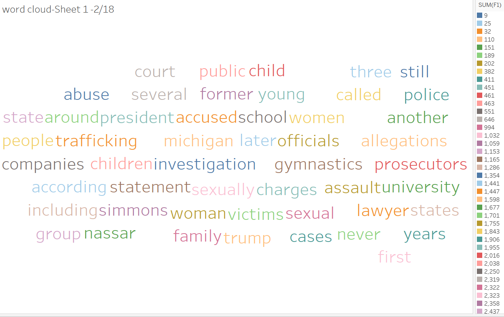

- The same way above image would give the most occured word as a first and sexual, Group as a most frequent wrods during February of 2018.

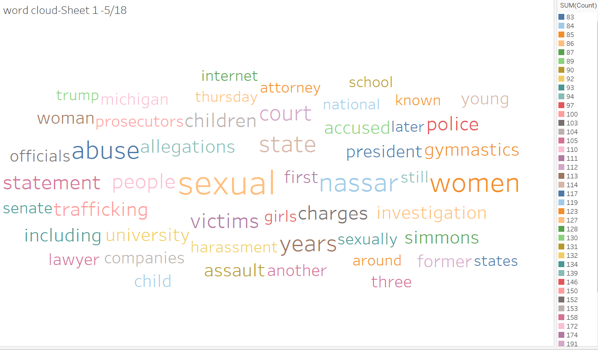

- for the current month of May famous child molester Nassar and sexual, Women are the top of the sexual harrasment cases discribed in the new york times articles.

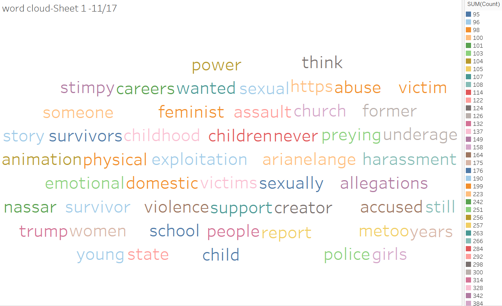

-Girls, Trump and victims are the most frequent words for the time span of August 2017.


```
neg_cnt = 0
pos_cnt = 0
for obj in test_neg: 
    res =  classifier.classify(extract_features(obj.split()))
    if(res == 'Negative'): 
        neg_cnt = neg_cnt + 1
for obj in test_pos: 
    res =  classifier.classify(extract_features(obj.split()))
    if(res == 'Positive'): 
        pos_cnt = pos_cnt + 1
        
print('[Negative]: %s/%s '  % (len(test_neg),neg_cnt))        
print('[Positive]: %s/%s '  % (len(test_pos),pos_cnt))  

```


- This code is used to determine the number of positive and negative words.
- Two For loops are used for knowing each word.
The output from this code is shown below:

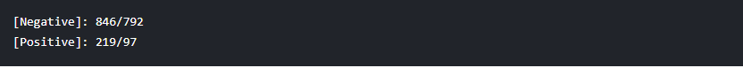

From the output above we could analyse that in a year the victims of sexual abuse varies in number, in their age and the offenders keep on changing. It can be asserted that the law is not effective in combating the issue.

## Document clustering using Naive Bayes, Logistic Regression and Random Forests.


This shows the collection of the data from the canopy command prompt along with their counts.

Further On we have created the Pipeline which includes 
1.	Tokenization 
2.	Stop words Remover 
3.	Term Frequency – Inverse Document Frequency
4.	Labeling according to the category 
Spark will label the according to the category in such a way that the category which appears most of the time will be assigned “0”  in our case that was politics. It will create finally the data frame which will be used for building our Predictive model. Once we have created the pipeline it is time to divide it into training and test set. We have choose training set as 80% and test set as 20%.  Below is the code which we have used for creating the pipeline and splitting up the data. 


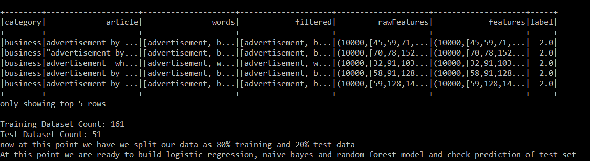

80% of the data is used for training and rest for testing. A pipeline of words is created. After they are filtered, raw features are collected which are the TF-IDF (term frequency-inverse document frequency) and then finally collecting the features and they are labelledaccordingly. This is an extension to above mentioned code wherein 2 levels are used whereas 4 levels are considered.

The 4 levels are: Sports, politics, business and movies.

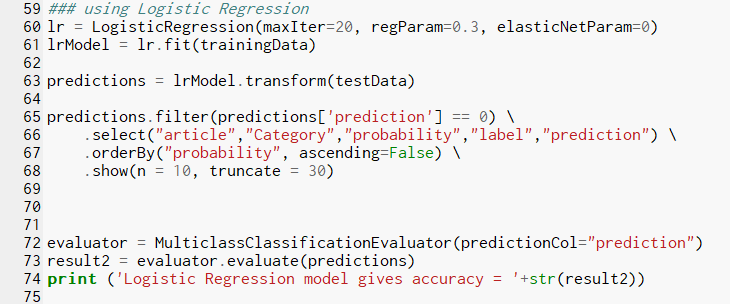

The above code is for performing logistic regression on the data.

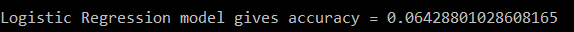

Above is Logistic regression output.

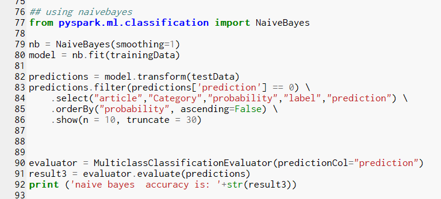

Above code is for conducting Naive Bayes.

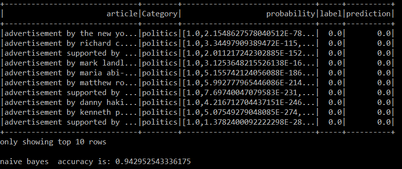

Output of NaiveBayes. The accuracy of the model is 94.3%.

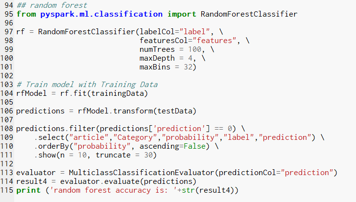

Using Random forest on the data using the above code.

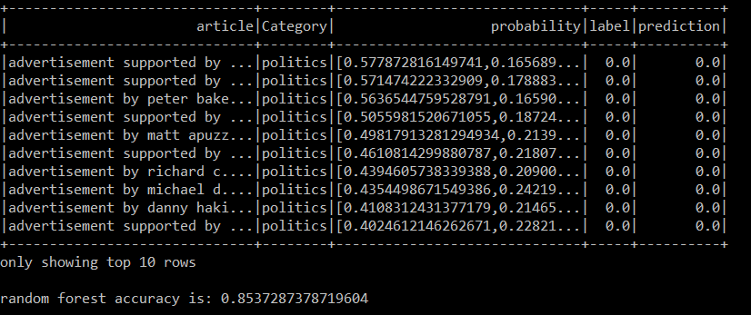

Above is Random Forest output and accuracy.


---

## How to Run the Code

1. Ensure that you have registered for the The New York Times API key.

2. Ensure that you have installed necessary Python packages. (Again, you may have a look at the requirement section of this ReadMe in order to know the required libraries)


2. Open a terminal window.

2. Change directories to where `FinalProject.py` is saved.

3. Type the following command:
	```
	python FinalProject.py
	```


---

## Results from your Analysis
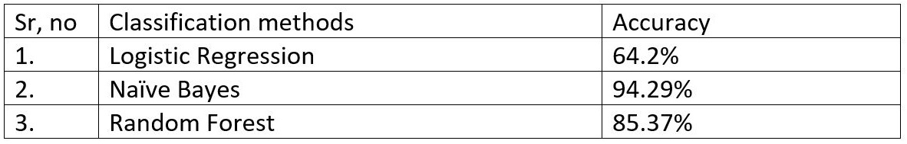

Above is a Compilation of Results

* Improvement suggestions in the model:

In machine learning we can use Bootstraping for validating testing and training datasets. We can better models based on bootstrapping and we can use it in production systems, i.e. artificial intelligence work field. Other than that we can use other methods used for classification like support vector machines can be used. Also, TFIDF is one of the ways of determining the clusters but other methods like counter, words are also prevelant which sometimes produce better results.

## CONCLUSIONS:
The word cloud can be assessed using the following: 
* Size of the word directly proportional to frequency.
* The colors represent the sum count of the words.
As per the word cloud, the word sexual was used the most amount of times followed by women and nassar.

## References:
* [1] http://sundog-education.com/datascience/
* [2] https://www.kaggle.com/ngyptr/python-nltk-sentiment-analysis/code
* [3] https://stackoverflow.com/questions/18952716/valueerror-i-o-operation-on-closed-file
* [4] https://www.youtube.com/watch?v=95p3cVkqYHQ

